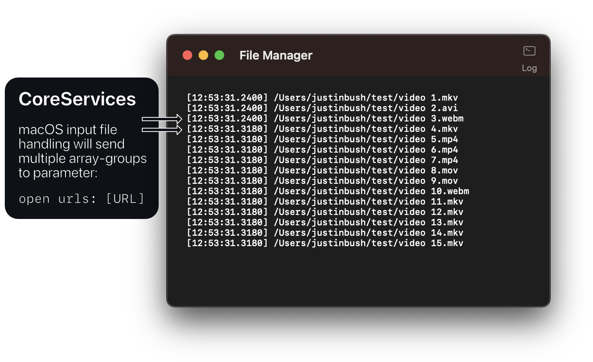

<i>Fig 1. Import 15 files using CoreServices (drag-drop onto dock icon; alternatively Finder, Open With...)</i>

## Issue

Upon importing multiple files via the Finder app (and its extended libraries), <a href="https://developer.apple.com/documentation/coreservices">CoreServices</a> will decide on how to handle NSApplicationDelegate's `application(_ application: NSApplication, open urls: [URL])` method.

This generally results in CoreServices making two separate calls to the method – the second occuring roughly 0.05-0.09s proceeding the first.

## Resolution

Until Apple fixes this issue, a file queue can be created, preferably by implementing an input-buffer on the main thread. There is no way to predetermine the number of calls that CoreServices may make to the application.
